# Architecture Design Document
## BT Wholesale — Web Scrape to React Component System

**Version:** 1.0  
**Date:** 2026-05-13  
**Stack:** Next.js 16 · TypeScript · CSS Modules · Design Tokens  
**Source:** https://www.btwholesale.com/

---

## Table of Contents

1. [Executive Summary](#1-executive-summary)
2. [System Architecture Overview](#2-system-architecture-overview)
3. [Scraping & Content Extraction Pipeline](#3-scraping--content-extraction-pipeline)
4. [Project Directory Structure](#4-project-directory-structure)
5. [Component Architecture](#5-component-architecture)
6. [Data Flow Architecture](#6-data-flow-architecture)
7. [Content API Design](#7-content-api-design)
8. [Design Token System](#8-design-token-system)
9. [Build & Rendering Pipeline](#9-build--rendering-pipeline)
10. [Technology Decisions](#10-technology-decisions)

---

## 1. Executive Summary

This document describes the end-to-end architecture for converting a live marketing website (BT Wholesale) into a structured, maintainable Next.js application. The process has three principal phases:

| Phase | Activity | Output |
|-------|----------|--------|
| **Extract** | Analyse and scrape the source page | `site-content.json` |
| **Model** | Define typed interfaces for all content | `types/content.ts` |
| **Build** | Implement components + API + design tokens | Deployable Next.js app |

All content is decoupled from markup. Components receive typed props; a static Next.js API route exposes the same content as JSON for any client-side consumer.

---

## 2. System Architecture Overview

The system is a statically-rendered Next.js application following a clear separation between **data**, **presentation**, and **styling**.

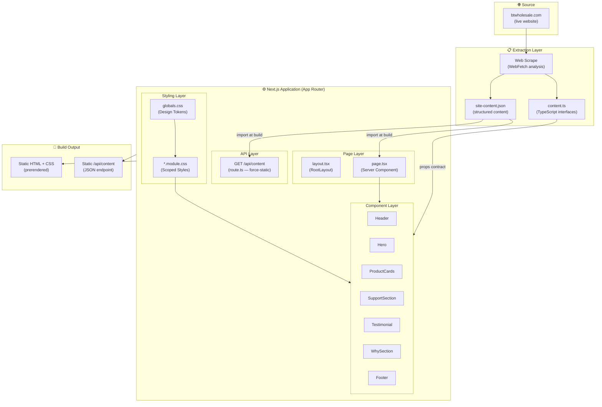

---

## 3. Scraping & Content Extraction Pipeline

The source page was analysed to identify discrete content regions. Each region maps directly to a component and a section of the content JSON.

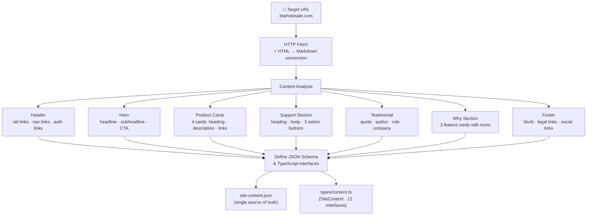

### Content Regions → Component Map

| Source Region | Component | Key Content Fields |
|---------------|-----------|-------------------|
| Top utility bar | `Header` | `utilityLinks[]` |
| Primary navigation | `Header` | `navLinks[]`, `authLinks[]` |
| Above-fold hero | `Hero` | `headline`, `subheadline`, `cta` |
| Product grid | `ProductCards` | `cards[].heading`, `cards[].links[]` |
| Contact banner | `SupportSection` | `heading`, `actions[].variant` |
| Customer quote | `Testimonial` | `quote`, `author`, `company` |
| Value props | `WhySection` | `cards[].icon`, `cards[].description` |
| Site footer | `Footer` | `partnerBlurb`, `legalLinks[]`, `socialLinks[]` |

---

## 4. Project Directory Structure

```
bt-wholesale/
│
├── src/
│   ├── app/                          # Next.js App Router root
│   │   ├── globals.css               # ← Design Token definitions (:root vars)
│   │   ├── layout.tsx                # RootLayout — html/body shell + metadata
│   │   ├── page.tsx                  # Home page — Server Component, imports JSON
│   │   └── api/
│   │       └── content/
│   │           └── route.ts          # GET /api/content — static JSON endpoint
│   │
│   ├── components/                   # One directory per component
│   │   ├── Header/
│   │   │   ├── Header.tsx
│   │   │   └── Header.module.css
│   │   ├── Hero/
│   │   │   ├── Hero.tsx
│   │   │   └── Hero.module.css
│   │   ├── ProductCards/
│   │   │   ├── ProductCards.tsx
│   │   │   └── ProductCards.module.css
│   │   ├── SupportSection/
│   │   │   ├── SupportSection.tsx
│   │   │   └── SupportSection.module.css
│   │   ├── Testimonial/
│   │   │   ├── Testimonial.tsx
│   │   │   └── Testimonial.module.css
│   │   ├── WhySection/
│   │   │   ├── WhySection.tsx
│   │   │   └── WhySection.module.css
│   │   └── Footer/
│   │       ├── Footer.tsx
│   │       └── Footer.module.css
│   │
│   ├── content/
│   │   └── site-content.json         # ← Single source of truth for all content
│   │
│   └── types/
│       └── content.ts                # TypeScript interfaces for all content shapes
│
├── public/                           # Static assets
├── next.config.ts
├── tsconfig.json
└── package.json
```

---

## 5. Component Architecture

### 5.1 Component Tree

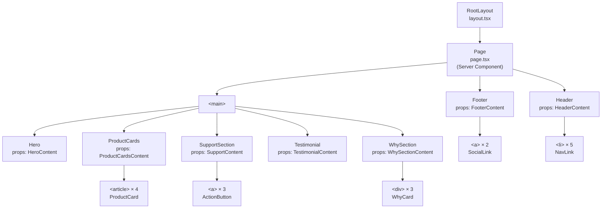

### 5.2 Component Responsibilities

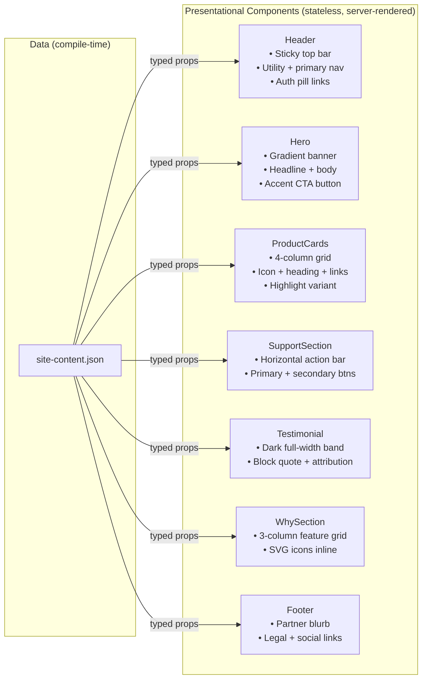

---

## 6. Data Flow Architecture

### 6.1 Build-Time Flow (SSG)

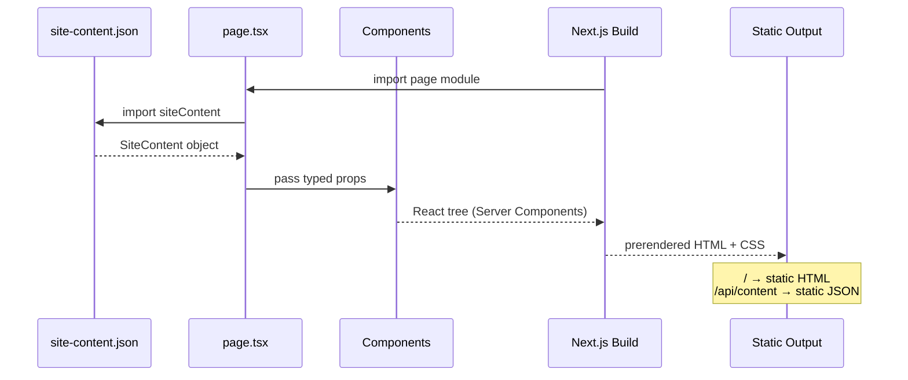

### 6.2 Runtime API Flow (Client consumers)

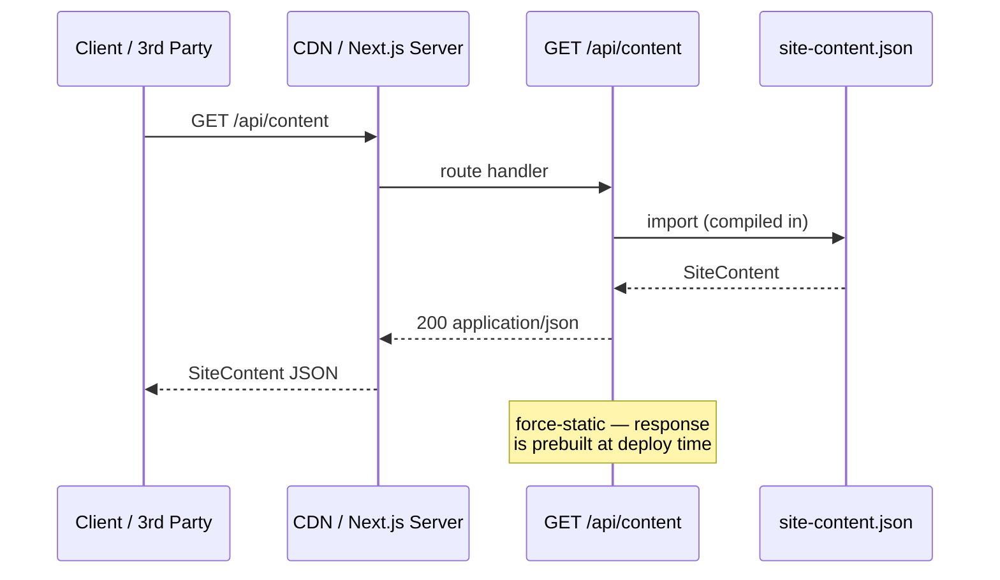

### 6.3 Content → Render Mapping

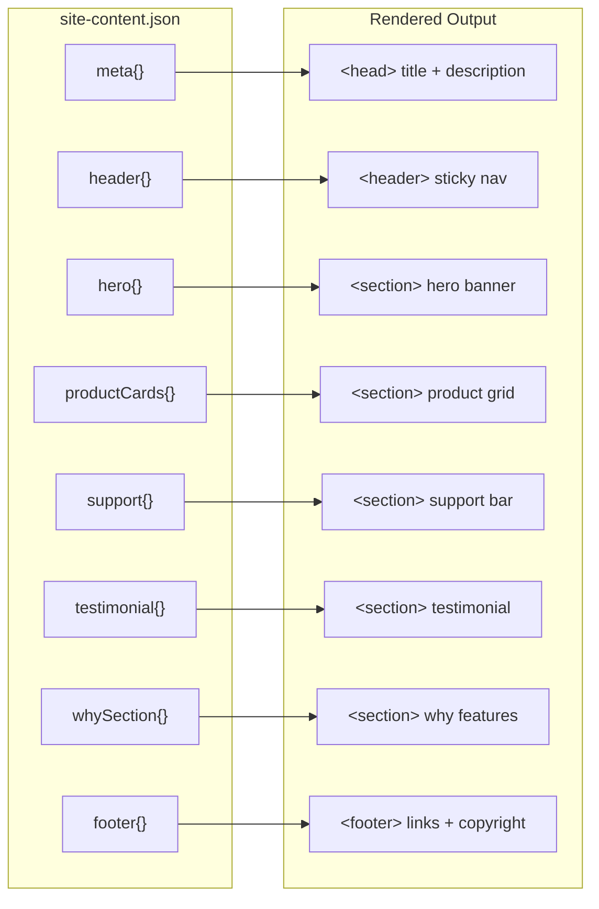

---

## 7. Content API Design

### 7.1 Endpoint

| Attribute | Value |
|-----------|-------|
| Method | `GET` |
| Path | `/api/content` |
| Response type | `application/json` |
| Rendering | `force-static` (prebuilt at deploy) |
| Auth | None (public) |
| Cache | Edge-cacheable indefinitely |

### 7.2 Response Schema

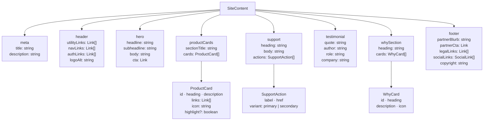

### 7.3 TypeScript Interface Hierarchy

```
SiteContent
├── MetaContent
├── HeaderContent
│   └── Link[]  (utilityLinks, navLinks, authLinks)
├── HeroContent
│   └── Link    (cta)
├── ProductCardsContent
│   └── ProductCard[]
│       └── Link[]  (links)
├── SupportContent
│   └── SupportAction[]  extends Link + variant
├── TestimonialContent
├── WhySectionContent
│   └── WhyCard[]
└── FooterContent
    ├── Link    (partnerCta)
    ├── Link[]  (legalLinks)
    └── SocialLink[]
```

---

## 8. Design Token System

All visual decisions are expressed as CSS Custom Properties declared on `:root` in `globals.css`. Component `*.module.css` files consume tokens exclusively — no hardcoded values.

### 8.1 Token Categories

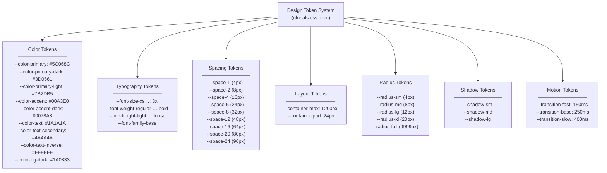

### 8.2 Token Consumption Flow

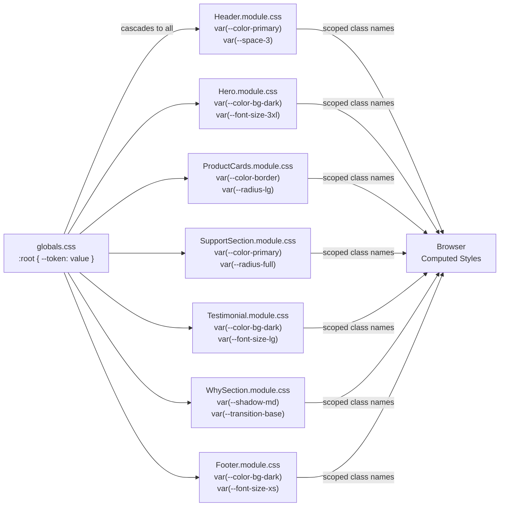

### 8.3 Color Palette

| Token | Value | Used In |
|-------|-------|---------|
| `--color-primary` | `#5C068C` | Nav, buttons, icons, card headings |
| `--color-primary-dark` | `#3D0561` | Hover states, headings, footer text |
| `--color-primary-light` | `#7B2DB5` | Gradients, why-card icons |
| `--color-accent` | `#00A3E0` | Hero CTA, testimonial quote icon, partner link |
| `--color-bg-dark` | `#1A0833` | Testimonial, Footer background |
| `--color-bg-light` | `#F5F4F7` | Product section background, icon backgrounds |

---

## 9. Build & Rendering Pipeline

### 9.1 Next.js Build Process

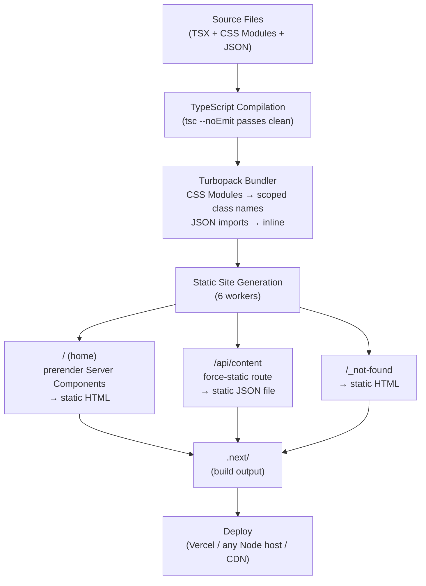

### 9.2 Rendering Strategy

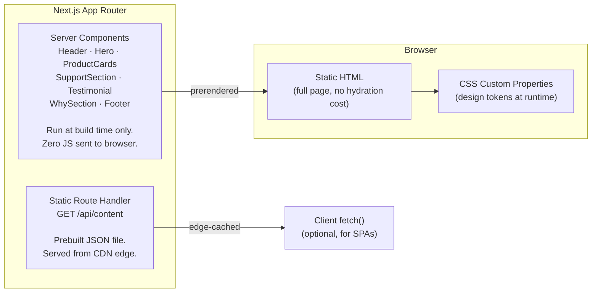

### 9.3 Page Weight Analysis

| Asset | Strategy | Client JS |
|-------|----------|-----------|
| `page.tsx` | Server Component | 0 KB |
| All 7 components | Server Components | 0 KB |
| CSS Modules | Extracted at build | 0 KB runtime |
| Design tokens | CSS custom props | ~2 KB |
| Inline SVG icons | Server-rendered | 0 KB |
| **Total JS to browser** | — | **~0 KB** |

> All components are Server Components — the browser receives pure HTML + CSS with no React hydration overhead.

---

## 10. Technology Decisions

### 10.1 Stack Rationale

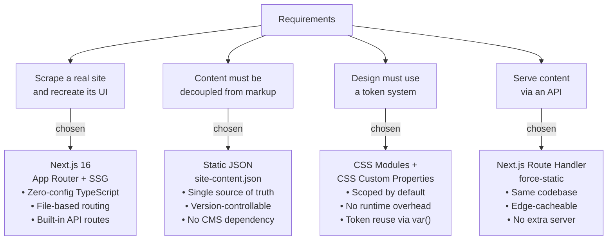

### 10.2 Alternatives Considered

| Decision | Chosen | Rejected | Reason |
|----------|--------|----------|--------|
| CSS approach | CSS Modules + tokens | Tailwind, styled-components | Scoped styles + zero runtime, explicit token system |
| Content API | Next.js route handler | Express.js, MSW | Same repo, no extra server, static prerender |
| Data source | JSON import | CMS, database | Static content doesn't need runtime data fetching |
| Rendering | All Server Components | Client Components | No interactivity needed; zero JS to browser |
| Icons | Inline SVG | Icon library | No dependency, full colour control via `currentColor` |

---

## Appendix A — Interface Reference

```typescript
// Full TypeScript interface tree — types/content.ts

SiteContent {
  meta:         MetaContent
  header:       HeaderContent
  hero:         HeroContent
  productCards: ProductCardsContent
  support:      SupportContent
  testimonial:  TestimonialContent
  whySection:   WhySectionContent
  footer:       FooterContent
}

Link             { label: string; href: string }
SupportAction    extends Link + { variant: "primary" | "secondary" }
SocialLink       { platform: string; href: string }
ProductCard      { id, heading, description, links: Link[], icon, highlight?: boolean }
WhyCard          { id, heading, description, icon }
```

## Appendix B — Component Props Contract

| Component | Prop | Type |
|-----------|------|------|
| `Header` | `content` | `HeaderContent` |
| `Hero` | `content` | `HeroContent` |
| `ProductCards` | `content` | `ProductCardsContent` |
| `SupportSection` | `content` | `SupportContent` |
| `Testimonial` | `content` | `TestimonialContent` |
| `WhySection` | `content` | `WhySectionContent` |
| `Footer` | `content` | `FooterContent` |

Every component accepts exactly one `content` prop typed to its matching interface. No component reaches outside its prop boundary.

---

*Generated for the BT Wholesale scrape-to-React project · Next.js 16 · TypeScript · CSS Modules*
